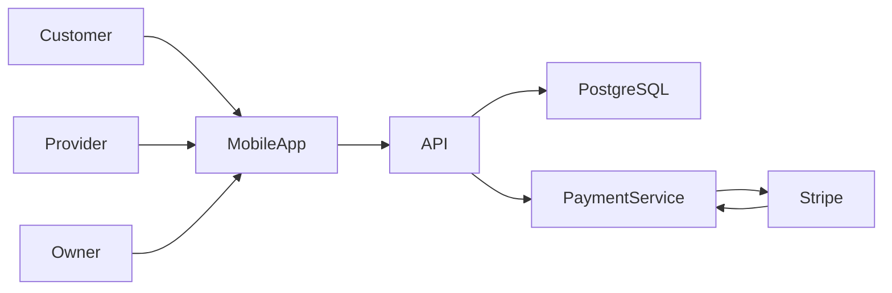
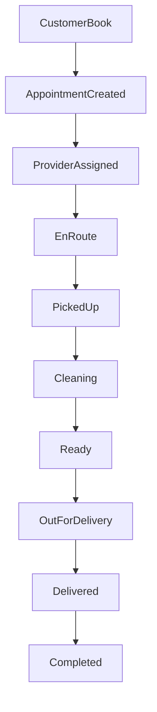
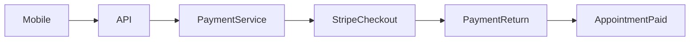
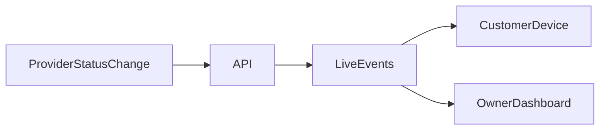

# Architecture Diagrams

## System Context

```mermaid
flowchart LR
  Customer --> MobileApp
  Provider --> MobileApp
  Owner --> MobileApp

  MobileApp --> API

  API --> PostgreSQL
  API --> PaymentService

  PaymentService --> Stripe
  Stripe --> PaymentService
```

## Booking Lifecycle

```mermaid
flowchart TD
  CustomerBook --> AppointmentCreated
  AppointmentCreated --> ProviderAssigned
  ProviderAssigned --> EnRoute
  EnRoute --> PickedUp
  PickedUp --> Cleaning
  Cleaning --> Ready
  Ready --> OutForDelivery
  OutForDelivery --> Delivered
  Delivered --> Completed
```

## Payment Flow

```mermaid
flowchart LR
  Mobile --> API
  API --> PaymentService
  PaymentService --> StripeCheckout
  StripeCheckout --> PaymentReturn
  PaymentReturn --> AppointmentPaid
```

## Live Update Flow

```mermaid
flowchart LR
  ProviderStatusChange --> API
  API --> LiveEvents
  LiveEvents --> CustomerDevice
  LiveEvents --> OwnerDashboard
```

