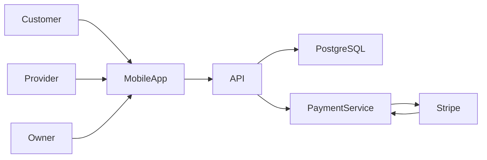
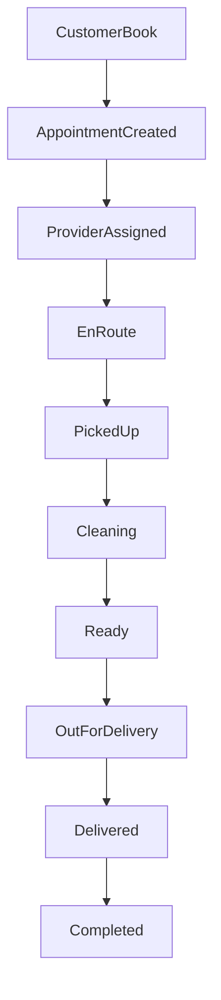
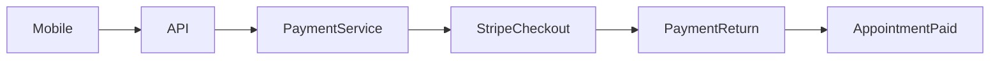
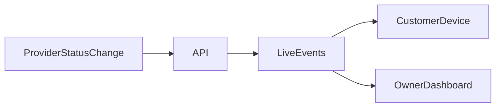

# ShoeInn Architecture Overview

ShoeInn is a premium care marketplace demo composed of:

- React Native Mobile App
- FastAPI Backend API
- Optional Payment Service
- PostgreSQL
- Stripe
- Live Event System
- Notification System

## Responsibilities

### Mobile App

`apps/mobile` is an Expo React Native application. It provides customer discovery and booking, provider job workflows, company admin operations, notifications, maps, and payment return handling. It communicates with the backend API over HTTP and live update endpoints.

### API

`apps/api` is the core FastAPI backend. It owns users, auth, companies, care categories, services, appointment holds, appointments, assignment/claiming, status transitions, notification outbox, push token registration, payment gateway orchestration, and demo seed data.

### Payment Service

`apps/payment` is optional for most local work. In service payment mode, the API delegates Stripe Checkout creation and payment reconciliation to it. The service owns Stripe API calls, payment records, webhook handling, and payment-domain outbox rows.

### PostgreSQL

PostgreSQL stores API domain data in local/staging deployments. API migrations are managed by Alembic in `apps/api/alembic`.

### Stripe

Stripe is used only when the API is configured with `PAYMENT_MODE=service` and the payment service is running. Mock payment mode is the default local path.

### Live Event System

The current live update system is process-local and suitable for a single API instance. It supports customer/provider/owner appointment status updates in the demo flows. Multi-instance fanout needs a shared transport before horizontal API scaling.

### Notification System

The API stores notification work in `notification_outbox`. The notification worker drains queued delivery work. Mobile notification screens also consume notification API state and local archive/filter state.

## System Context

## Booking Lifecycle

## Payment Flow

## Live Update Flow

## Documentation Map

- [Mobile architecture](mobile.md)
- [API architecture](api.md)
- [Payment architecture](payment.md)
- [Deployment architecture](deployment.md)
- [Environment reference](../environment.md)
- [Getting started](../getting-started.md)
- [Troubleshooting](../troubleshooting.md)

