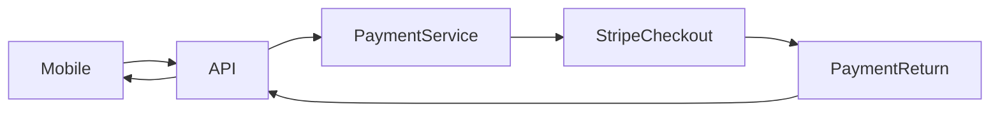

# Payment Architecture

`apps/payment` is an optional FastAPI service for Stripe-backed checkout. It is not required for mock local bookings.

## Responsibilities

- Create Stripe Checkout Sessions.
- Create/reuse Stripe Customers for returning customers.
- Persist payment records.
- Reconcile Stripe Checkout Session and PaymentIntent state.
- Handle Stripe webhooks.
- Optionally notify the booking API through `BOOKING_API_WEBHOOK_URL`.
- Persist payment-domain outbox rows.

## Service Flow



## Local Defaults

Payment service:

- Port: `8001`
- Health: `GET /health`
- Database default: `sqlite:///./payment.db`

API service mode:

```env
PAYMENT_MODE=service
PAYMENT_SERVICE_BASE_URL=http://localhost:8001
PAYMENT_MOBILE_REDIRECT_BASE=shoeinn://app
```

## Webhooks

Stripe webhooks are handled at:

```text
POST /payments/webhooks/stripe
```

Local forwarding:

```powershell
stripe listen --forward-to http://localhost:8001/payments/webhooks/stripe
```

## Current Limits

- No Alembic migrations for payment service schema.
- No local broker publisher for payment outbox rows.
- No separate card-management UI.
- Refund/dispute support exists at state/event level but production support workflows are future work.

